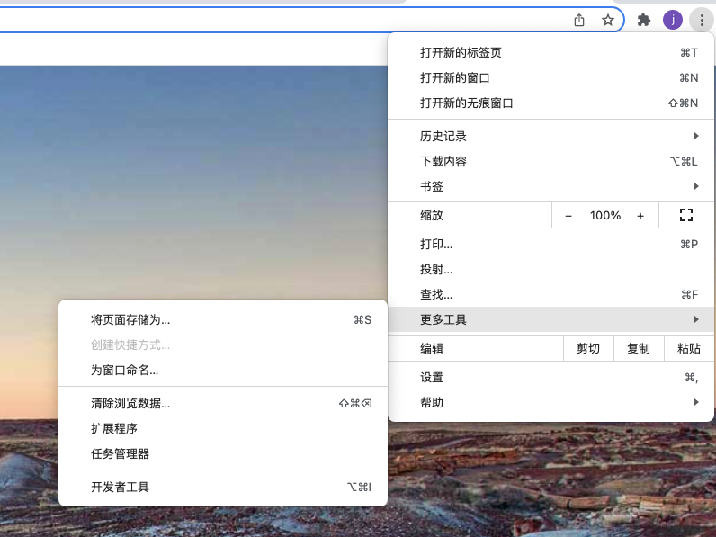
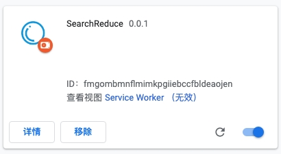

<details>
  <summary>目录</summary>
  <ol>
    <li>
      <a href="#about-the-project">关于本项目</a>
      <ul>
        <li><a href="#built-with">使用到的开源代码</a></li>
      </ul>
    </li>
    <li>
      <a href="#getting-started">快速开始</a>
      <ul>
        <li><a href="#prerequisites">使用条件</a></li>
        <li><a href="#installation">安装</a></li>
      </ul>
    </li>
    <li><a href="#usage">Usage</a></li>
    <li><a href="#roadmap">Roadmap</a></li>
    <li><a href="#contributing">Contributing</a></li>
    <li><a href="#license">License</a></li>
    <li><a href="#contact">Contact</a></li>
    <li><a href="#acknowledgments">Acknowledgments</a></li>
  </ol>
</details>
## 安装

1. 克隆项目到本地

   ```sh
   git clone https://github.com/charonX/search_reduce.git
   ```

2. 打开 Chrome 扩展程序界面

   

3. 在页面右上角打开开发者模式

   

4. 点击加载已解压的扩展程序按钮，选择刚刚下载的代码目录

   

5. 结果显示如下图，安装完成。

   

<p align="right">(<a href="#top">back to top</a>)</p>

## 使用
### 注意事项
首次安装插件后，打开新页面 Chrome 会提示新标签页被插件修改，如下图：


点击保持现状按钮后继续使用插件，点击改回原来的设置按钮则插件不启用。

### 新标签页

#### 展示


#### 功能点

1. 搜索框
2. 快捷网址入口

### 地址栏快捷操作

### 搜索结果页